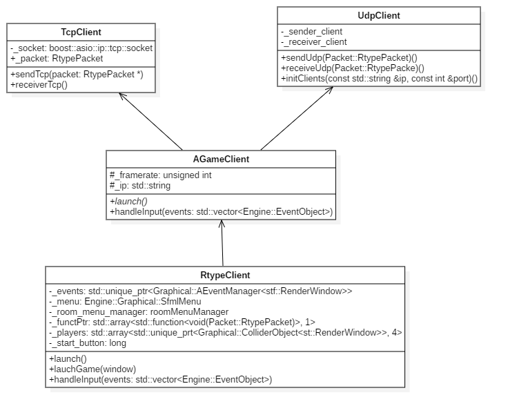

# R-Type project

The project consists in a client/server architecture game similar to R-Type
game.

# Install the dependencies:

### Linux Installation:
   - Install Conan: https://docs.conan.io/en/latest/installation.html
   - Install CMake: https://cmake.org/install/
   - Install Automake : Try "sudo apt-get install automake" or http://archive.linuxfromscratch.org/lfs-museum/5.1-pre1/LFS-BOOK-5.1-PRE1-HTML/chapter06/automake.html
   - Install m4 : https://geeksww.com/tutorials/libraries/m4/installation/installing_m4_macro_processor_ubuntu_linux.php
   - Install libtool : https://www.gnu.org/software/libtool/

### Windows Installation:
   - Install Conan: https://docs.conan.io/en/latest/installation.html
   - Install CMake: https://cmake.org/install/

### Install all the dependencies:
   - Go to the root directory "CPP_rtype_2018".
   - Add the remotes:
     1. conan-center: https://bintray.com/conan/conan-center
     2. epitech: https://bintray.com/epitech/public-conan
     3. bincrafters: https://bintray.com/bincrafters/public-conan

   - Tap on your terminal: `conan install`
   
### Compile:

#### Linux:
		
Tap : `mkdir build && cd build && conan install .. -s compiler.libcxx=libstdc++11 --build sfml && cmake .. -G "Unix Makefiles" && cmake -build .`

#### Windows:
Tap : `mkdir build && cd build && conan install .. -s compiler.libcxx=libstdc++11 --build sfml && cmake .. -G "Visual Studio 15" && cmake -build .`

Finally, type `make`

### launch:
	- Go to the directory "build/bin".
	-launch "./r-type_server"
	-launch as many time you want a game client "./r-type_client ip" where ip is	the server Ip

# Protocol documentation:
	-Protocol rfc in directory "Docs/Communication_Protocol_Rtype"
# Architecture:

Game Engine graphical classes:   
   

Events handling classes:   
   

Menu creator classes:   
   

Threads abstraction classes:   
   

Game server abstraction classes:   
   

Server Architecture:   
   

Client Architecture:   
   

Network Common Parts:   
   

# Authors:
Aziz Chigri - Benjamin Chadelaud - Thibaud Salsa
